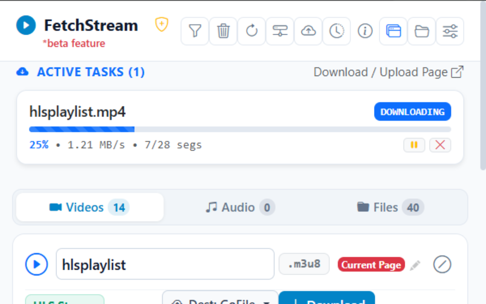
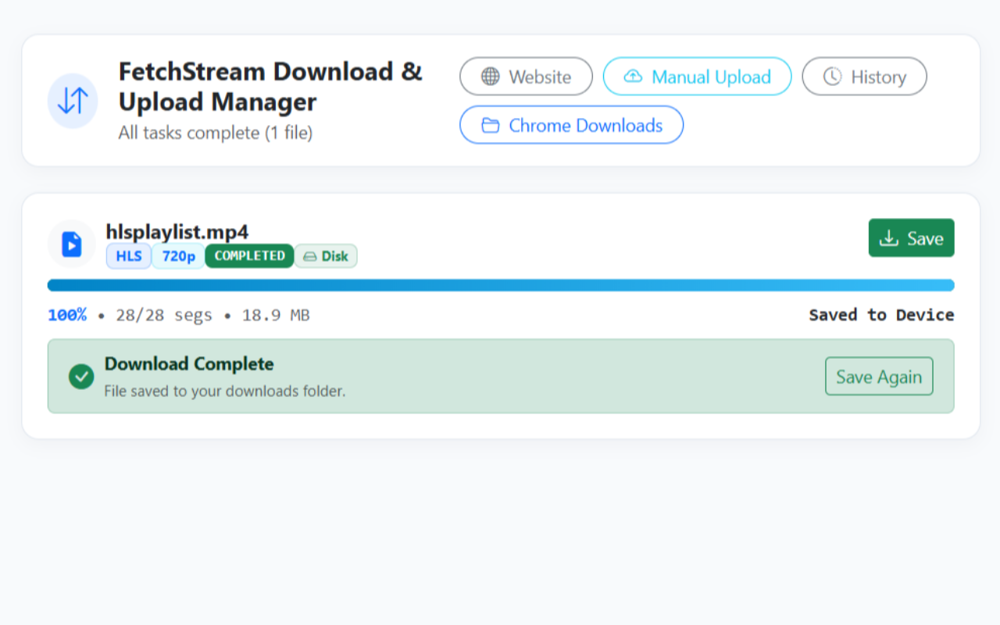
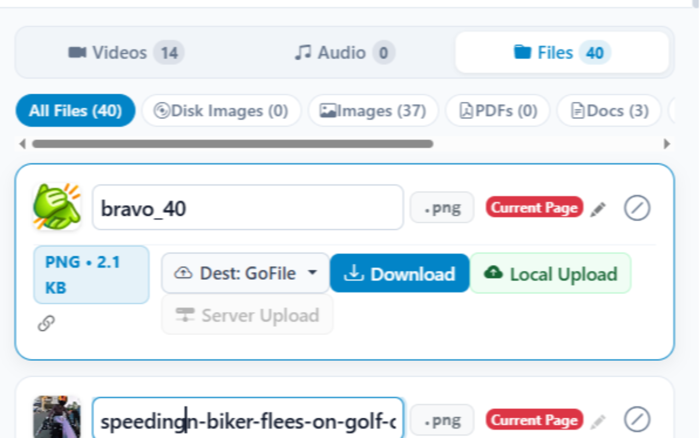
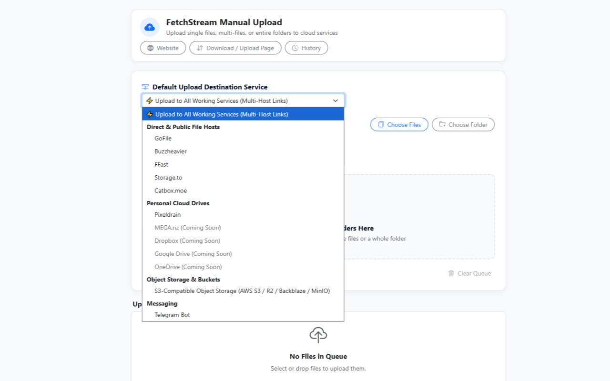
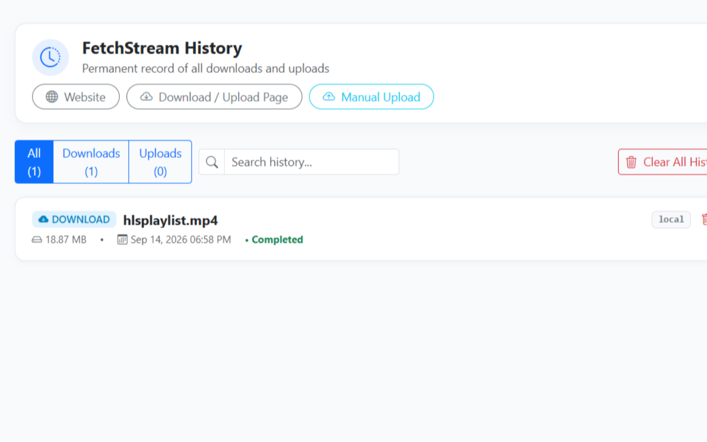
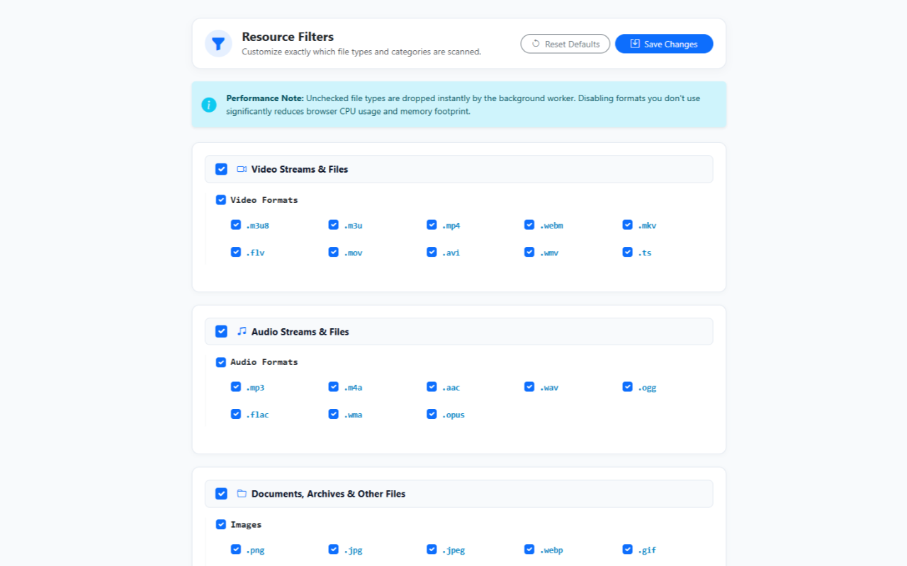
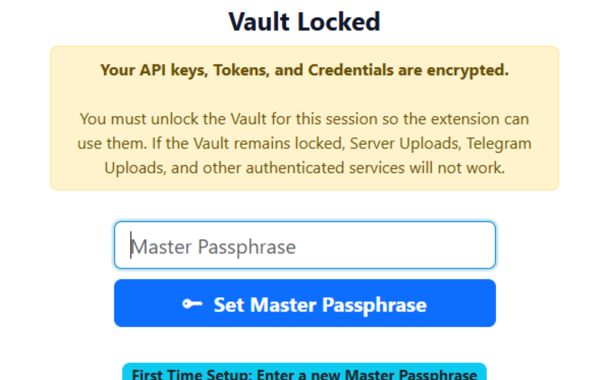

<div align="center">
  

  <h1>FetchStream</h1>
  
  <p><strong>Universal Web Media &amp; Stream Inspector, HLS Downloader, Disk Image &amp; Cloud Uploader for Google Chrome (Manifest V3).</strong></p>
  
  <p>
    <a href="https://github.com/Abhishek-banal/fetchstream/releases/latest/download/fetchstream-extension.zip">
      
    </a>
  </p>

  <p>
    🌐 <strong>Website:</strong> <a href="https://fetchstream.in">fetchstream.in</a> &nbsp;|&nbsp;
    📖 <a href="https://fetchstream.in/documentation.html">Documentation &amp; API</a> &nbsp;|&nbsp;
    ❓ <a href="https://fetchstream.in#faq">FAQ</a> &nbsp;|&nbsp;
    🔒 <a href="https://fetchstream.in#privacy">Privacy Policy</a>
  </p>
</div>

  [](https://developer.chrome.com/docs/extensions/mv3/intro/)
  [](https://developer.mozilla.org/en-US/docs/Web/JavaScript)
  [](https://getbootstrap.com/)
  [](https://opensource.org/licenses/GPL-3.0)

</div>

---

## Overview

**FetchStream** is an all-in-one browser extension designed to detect, download, package, and upload media streams and web files directly from your browser with zero server proxies and zero cloud dependencies.

<div align="center">
  <!-- Row 1 -->
  
  &nbsp;&nbsp;&nbsp;&nbsp;
  
  <br><br>
  
  <!-- Row 2 -->
  
  &nbsp;&nbsp;&nbsp;&nbsp;
  
  <br><br>
  
  <!-- Row 3 -->
  
  &nbsp;&nbsp;&nbsp;&nbsp;
  
  <br><br>

  <!-- Row 4 -->
  
</div>

Built natively on Chrome's **Manifest V3** platform, FetchStream handles high-bitrate live and recorded streams using the **Origin Private File System (OPFS)**, enabling gigabyte-scale downloads with constant, minimal memory usage.

---

## ✨ Features

### 1. 🔍 Media Stream Inspection & Detection
- **Adaptive HLS/M3U8 Capture**: Reads and parses `.m3u8` playlists in real time.
- **Resolution & Quality Selector**: Probes master playlists to detect individual video streams (1080p, 720p, 480p, etc.) with resolution badges.
- **Multi-Category Asset Detection**: Categorizes network assets into **Videos**, **Audio**, and **Files** (with dedicated subcategories: **Disk Images** (`.iso`, `.bin`, `.img`, `.dmg`, `.mdf`, etc.), Images, PDFs, Docs, Sheets, Slides, Archives).
- **Embedded PDF Document Export**: Automatically identifies embedded PDF documents on web viewers (such as PDF.js) and exports standard PDF files.
- **Advanced Dynamic Filtering**: Set precise size thresholds (min/max bytes), filter specific file extensions, or block domains. Filters are instantly applied retro-actively to the global history and active streams without reloading.
- **SPA Architecture Awareness**: Intelligently hooks into Single Page Applications (like YouTube) using active URL state verification to prevent old streams from improperly tagging as the current page.

### 2. ⚡ High-Speed Stream Downloader
- **OPFS Disk-Backed Storage**: Writes media segments directly to disk chunks via the browser's Origin Private File System, preventing out-of-memory crashes on large files.
- **Multi-Threaded Parallel Fetching**: Downloads media segments concurrently with automatic retry logic.
- **AES-128 Stream Processing**: Built-in WebCrypto-based processing for standard AES-128 HLS streams.
- **Strict MP4 Enforcement**: Transmuxes and outputs all HLS video streams as clean `.mp4` video files.
- **Task Controls**: Real-time progress bars, speed metrics, pause, resume, and cancellation.

### 3. ☁️ Universal Multi-Service Cloud Uploader
Upload detected media or local files directly to leading storage services:
- **Direct File Hosting Providers**:
  - [GoFile.io](https://gofile.io) (Unrestricted high-speed file hosting with direct download links)
  - [Buzzheavier.com](https://buzzheavier.com) (Ultra-fast temporary cloud offloading up to 50 GB)
  - [Pixeldrain.com](https://pixeldrain.com) (Fast cloud file hosting up to 10 GB)
  - [FFast](https://fuckingfast.co) (Parallel chunked streaming pipeline up to 5 GB)
  - [Storage.to](https://storage.to) (Instant direct API cloud hosting up to 5 GB)
  - [Catbox.moe / Litterbox](https://catbox.moe) (Permanent clips up to 200 MB or temporary Litterbox shares)
- **Generic S3-Compatible & Object Storage**:
  - Works with any S3 API provider: **AWS S3, Cloudflare R2, Backblaze B2, MinIO, and Hugging Face Buckets** using browser-native AWS SigV4.
  - Automatically generates 7-day pre-signed download URLs. Requires a standard bucket [CORS Policy](https://fetchstream.in/documentation#s3-cors-setup).
- **Telegram Bot & Channel (with Native 2 GB Engine)**:
  - **Standard Bot API**: Direct upload to private channels, groups, or chats (files $\le$ 50 MB).
  - **Native 2 GB MTProto Engine (Remote Runner)**: Automatic Pyrogram MTProto 2.0 streaming pipeline and local Bot API server support for files up to **2,000 MB (2 GB)**.
  - **Per-Item Captions & Descriptions**: Add custom text descriptions to media cards in the popup so files land in your channel with custom text and native streamable video cards.
- **Combined Cloud Storage + Telegram Relay**:
  - Parallel upload to S3 or Hugging Face Object Storage with automated playable video preview relay to your Telegram channel.
- **Custom Multi-Host Selection & "Upload to All"**:
  - Choose any combination of destination services via checkboxes (e.g. GoFile + S3 + Telegram) or upload to all working services simultaneously.
  - **Concurrent Processing**: Executes local multi-host uploads entirely in parallel, streaming real-time upload links into the UI instantaneously without waiting for all providers to finish.
- **Cloud Runner (0-Local-MB Server-Side Upload)**:
  - Offload stream capture and cloud uploads entirely to a remote server without using your computer's bandwidth.

#### 📊 Provider Sizing & Capability Matrix

| Destination Service | Local Upload Cap | Server Upload Cap | Authentication / Setup | Key Highlights |
| :--- | :---: | :---: | :--- | :--- |
| **GoFile.io** | Unrestricted | Unrestricted | None (Optional API Token) | High-speed permanent storage & direct streaming |
| **Buzzheavier.com** | 50 GB | 50 GB | None | Ultra-fast temporary cloud transfer |
| **Pixeldrain.com** | 10 GB | 10 GB | None (Optional API Key) | Fast reliable direct streaming links |
| **FFast** | 5 GB | 5 GB | None | Multi-chunk direct streaming downloads |
| **Storage.to** | 5 GB | 5 GB | None | Rapid direct API file sharing |
| **Catbox / Litterbox** | 200 MB | 200 MB | None (Optional Userhash) | Permanent Catbox clips or temporary Litterbox shares |
| **Telegram** | 50 MB | **2,000 MB / 2 GB** | Bot Token + Chat ID | Native streaming cards & custom captions in your channel |
| **Generic S3 / R2** | 5 TB (Multi-part) | 5 TB | Access Key + Secret Key + Bucket | Private cloud bucket (AWS S3, Cloudflare R2, MinIO, B2) |
| **Hugging Face** | 5 TB | 5 TB | HF Access Token + Bucket URL | Native AWS SigV4 storage into HF Buckets |
| **S3/HF + Telegram Relay** | Composite | Composite | Bucket Keys + Telegram Bot | Permanent cloud storage + instant Telegram channel alert |

---

### 4. 📦 Batch File & Folder Uploader
- Full-page tab with drag-and-drop batch upload area.
- **Folder Upload & Compression**: Client-side ZIP packaging for folder uploads using advanced OPFS (Origin Private File System) streaming.
- **Memory Protection**: Utilizes OPFS disk-streaming to completely prevent out-of-memory browser crashes, natively processing gigabyte-scale folder packaging directly in the browser with minimal RAM usage.
- **Per-Item Service Selection**: Assign different upload destinations to different items in the same queue.
- **Queue Controls**: Pause, resume, retry failed/cancelled items, or remove items individually.

### 5. 🕒 Permanent History Manager
- Permanent local log of all downloads and uploads.
- Filter by downloads, uploads, or search by filename.
- Persists across browser sessions until explicitly cleared.

### 6. 🔐 Secure AES-GCM Cryptographic Vault
- **Military-Grade Credential Storage**: To protect your highly sensitive API keys, S3 secrets, and Telegram Bot tokens, FetchStream features a built-in cryptographic Vault.
- **Local Encryption**: All credentials are encrypted directly on your device using WebCrypto **AES-GCM (256-bit)** before being committed to your browser's local storage database.
- **Master Passphrase Protection**: The vault is locked behind a custom master passphrase or PIN. Your credentials are only decrypted into ephemeral memory strictly for the duration of your active browser session, ensuring zero unauthorized cloud uploads or credential extraction by malware.
- **UI / UX Polish**: Clean, responsive popup interfaces featuring custom-styled Bootstrap modal dialogues for all alerts, confirmations, and security prompts.

---

## Project Structure

```text
fetchstream/
├── manifest.json              # Chrome Extension Manifest V3 configuration
├── service-worker.js          # Background service worker (stream detection, badge, state)
├── popup.html                 # Extension popup interface
├── downloader.html            # Dedicated download and stream processing tab
├── upload.html                # Dedicated manual upload batch interface
├── history.html               # Permanent history interface
├── filters.html               # Advanced dynamic options & global history filters
├── backend/                   # 🚀 Modular Remote Runner Backends & Blueprints
│   ├── README.md              # Universal REST API specification & guides
│   ├── docker/                # Option A: Self-hosted Docker & FastAPI runner (VPS/Home Lab)
│   │   ├── Dockerfile
│   │   ├── docker-compose.yml
│   │   ├── server.py
│   │   └── README.md
│   └── serverless/            # Option B: Custom Webhook Cloud Runner (Cloudflare Pages + CI/CD Pipelines)
│       ├── README.md          # Step-by-step private runner deployment guide
│       ├── workflows/         # CI/CD runner workflow
│       │   └── server-relay.yml
│       └── functions/api/     # Cloudflare Pages edge REST API functions
│           ├── server-relay.js
│           ├── server-status.js
│           ├── server-callback.js
│           └── stream-proxy.js
├── scripts/
│   ├── server_uploader.py     # Universal FFmpeg stream downloader & multi-host cloud uploader
│   └── requirements.txt       # Python dependencies for the remote runner script
├── js/
│   ├── popup.js               # Popup controller & DOM management
│   ├── downloader.js          # Stream download engine (HLS parser, OPFS writer, AES-128)
│   ├── upload.js              # Batch upload controller & queue manager
│   ├── uploader.js            # Universal multi-service upload client & SigV4 engine
│   ├── zip-builder.js         # Client-side OPFS ZIP file bundler
│   ├── vault.js               # Secure AES-GCM credential encryption engine
│   ├── dialog.js              # Custom styled modal UI engine
│   ├── popup_vault.js         # Vault UI controller
│   ├── history-manager.js     # Storage-backed history abstraction
│   ├── history.js             # History UI controller
│   ├── options.js             # Default configuration & settings definitions
│   └── hls-player.js          # Vendor HLS client library
├── bootstrap/                 # Embedded Bootstrap 5 CSS, JS, and Icons
├── img/                       # Extension icon assets
                 
```

---

## Installation & Setup

### 1. Installing the Chrome Extension
1. Clone or download this repository:
   ```bash
   git clone https://github.com/Abhishek-banal/fetchstream.git
   ```
2. Open Google Chrome (or any Chromium browser such as Brave, Edge, or Opera).
3. Navigate to `chrome://extensions`.
4. Enable **Developer mode** using the toggle in the top right corner.
5. Click **Load unpacked** in the top left corner.
6. Select the `fetchstream` project folder.
7. The **FetchStream** icon will appear in your browser toolbar. Pin it for quick access!

### Updating the Extension Safely
Because FetchStream runs completely locally, updating by "removing" the extension from Chrome will clear your local storage (including your History and Vault API keys). To update to a newer version **without losing your saved settings**, follow these steps:
1. Download the latest `.zip` release and extract it.
2. Open the extracted folder, select **all** the files inside, and copy them.
3. Go to your original installed `fetchstream` folder on your computer and **paste** the files, choosing to **Replace existing files**.
4. Finally, go to `chrome://extensions` in your browser and click the **Reload icon** (circular arrow) on the FetchStream card.
*(Tip: Always keep your installation folder in a safe place, like your C: Drive, so you don't accidentally delete it!)*

---

### 2. Setting Up the Remote Runner (Optional)

FetchStream works **100% locally out of the box** for direct downloads and local cloud uploads.

If you want **0-Local-MB cloud downloading** (downloading streams and uploading to cloud hosts entirely on a remote server without using your computer's bandwidth), connect the extension to any compatible runner:

#### Option A: Self-Hosted Docker Server (VPS / Local / NAS) — Instant
Run your own private runner with Docker in one command:
```bash
docker compose -f backend/docker/docker-compose.yml up -d --build
```
Then enter `http://localhost:8000` (or your domain, e.g. `https://downloader.yourdomain.com`) in **FetchStream Settings $\to$ Remote Server URL**.

* 📁 **Reference Code & Guide:** [`backend/docker/`](backend/docker/)

#### Option B: Custom Serverless (Cloudflare Pages + CI/CD Pipelines)
If you don't own a server, you can deploy  using your own  Cloudflare account and your custom CI/CD runner environments:
1. Create a private runner repository and copy the blueprints from [`backend/serverless/`](backend/serverless/).
2. Generate a [GHub Personal Access Token (classic)](https://github.com/settings/tokens) with `repo` and `workflow` scopes.
3. Deploy to Cloudflare Pages (connect your private repo and add `GITHUB_TOKEN` and `GITHUB_REPO` in `owner/repo` format to environment variables).
4. *(Optional)* In Cloudflare Pages, bind a  KV namespace named `RELAY_KV` under **Settings ➔ Functions ➔ KV namespace bindings** to enable fine-grained real-time percentage progress (0%–100%) and transfer speeds.
5. Enter your Pages URL (e.g. `https://my-fetchstream-runner.pages.dev`) in **FetchStream Settings $\to$ Remote Server URL**.

* 📁 **Reference Blueprints & Workflows:** [`backend/serverless/`](backend/serverless/)
* 📖 **Full Setup Guide & REST Specs:** [Online Documentation & API Reference](https://fetchstream.in/documentation) (or local [`public/documentation.html`](public/documentation.html))

#### 🔒 Securing Your Runner (API Key Protection)
To prevent unauthorized users from discovering or abusing your server URL and bandwidth quota:
1. **On Docker:** Set `API_KEY=your_secret_token` in `backend/docker/docker-compose.yml` or `.env`.
2. **On Cloudflare Pages:** Add an encrypted environment variable `API_KEY=your_secret_token` in your Pages project settings.
3. **In the Extension:** Open **Settings (⚙️) ➔ Server-Side Upload**, and paste your secret token into **Server API Key / Token (Optional)**.

When configured, any request without your exact secret key will be rejected immediately with HTTP `401 Unauthorized` before touching compute resources.

---

### 3. Telegram Upload Options & Setup Guide

FetchStream allows you to upload downloaded videos, audios, and files directly to a private Telegram Channel, Group, or Chat.

#### 🤖 Step-by-Step Telegram Setup Guide (Beginners)

1. **Create a Bot via BotFather**:
   - Open Telegram and search for [@BotFather](https://t.me/BotFather) (the official Telegram bot for managing bots).
   - Start a chat and send the command: `/newbot`
   - Enter a display name (e.g. `My Storage Bot`).
   - Enter a unique username ending in `bot` (e.g. `my_media_vault_bot`).
   - BotFather will reply with your **HTTP API Token** (e.g. `7123456789:AAFn73hK...`). Copy this token.

2. **Create a Private Channel & Add the Bot as Admin**:
   - In Telegram, create a new **Channel** (e.g. `My Cloud Vault`) and set it to **Private**.
   - Open **Channel Settings ➔ Administrators ➔ Add Admin**.
   - Search for your newly created bot username and add it.
   - Ensure the permission **"Post Messages"** is enabled so your bot can upload files.

3. **Get Your Channel's Numeric Chat ID**:
   - Post any test message (e.g. "hello") in your newly created channel.
   - Forward that message to a helper bot such as [@JsonDumpBot](https://t.me/JsonDumpBot) or [@userinfobot](https://t.me/userinfobot).
   - The helper bot will return a JSON object. Look for `forward_from_chat`:
     ```json
     "forward_from_chat": {
       "id": -1001234567890,
       "title": "My Cloud Vault",
       "type": "channel"
     }
     ```
   - Copy the numeric `id` value, including the `-100` prefix (e.g. `-1001234567890`).

4. **Save in FetchStream**:
   - Open the FetchStream extension and click **Settings (⚙️)**.
   - Under **Telegram Settings**, enter your **Bot Token** and **Chat ID**.
   - Click outside the panel to save. You can now upload detected media or local files directly to your Telegram channel!

> 💡 **Official Telegram References**:
> * [Telegram Bots: An Introduction for Developers](https://core.telegram.org/bots)
> * [Telegram BotFather Official Tutorial](https://core.telegram.org/bots/tutorial#obtain-your-bot-token)
> * [Telegram Bot API `sendDocument` Specification](https://core.telegram.org/bots/api#senddocument)

> **Note on Third-Party Hosting Limits**: File size limits, bandwidth allowances, and storage retention terms are defined and frequently updated by each respective hosting provider. Please verify current limits directly on their official websites.

---

## Permissions Used

| Permission | Purpose |
| :--- | :--- |
| `storage` | Storing user configuration, credentials, active tasks, and history locally. |
| `unlimitedStorage` | Providing unrestricted storage quota for the Origin Private File System (OPFS) to cache multi-gigabyte media streams. |
| `webRequest` | Inspecting media playlists and network file requests from active web pages. |
| `webRequestExtraHeaders` | Forwarding stream authentication headers (`Cookie`, `Authorization`, `Referer`) required to download video segments. |
| `declarativeNetRequest` | Handling cross-origin headers required for media stream downloads. |
| `downloads` | Saving completed video, audio, and file binaries to the local file system. |
| `tabs` & `scripting` | Detecting active page context, video elements, and embedded web document viewers. |
| `cookies` | Capturing active playback session cookies solely when you trigger optional Server Upload, allowing your private cloud runner to authenticate stream segments. |
| `host_permissions` (`http://*/*`, `https://*/*`) | Inspecting stream playlists and downloading video segments from any media hosting domain. |

---

## Privacy & Security

- **100% Client-Side Architecture**: All stream inspection, AES-128 processing, and local uploading execute entirely within your browser sandboxed environment.
- **No Telemetry or Tracking**: FetchStream does not bundle tracking pixels, external analytics, or remote logging scripts.
- **Encrypted Local Storage (The Vault)**: All API keys, tokens, and custom settings are stored strictly in `chrome.storage.local` on your device. Furthermore, sensitive credentials are encrypted using an **AES-GCM (256-bit)** master passphrase, protecting them from disk-reading malware and other extensions. Credentials are never sent to any central FetchStream server.
- **Stream Session Cookies & Authorization Forwarding (Server Upload)**: When using optional Server-Side Upload (Cloud Runner), active session headers—including `Cookie`, `Authorization` tokens, `User-Agent`, and `Referer`—are forwarded directly to your configured remote runner. This allows the remote FFmpeg engine to fetch authenticated stream segments without encountering HTTP `403 Forbidden` errors. **Always use a private runner that you personally operate or trust.**
- **Third-Party Hosting Non-Affiliation**: FetchStream is an independent open-source tool and is not affiliated with, endorsed by, or partnered with GoFile.io, Buzzheavier.com, Pixeldrain.com, Catbox.moe, Telegram, AWS, Cloudflare, or any other third-party host. FetchStream does not store, host, or moderate any files. All uploads are subject to the independent terms and policies of each provider, and users assume full legal responsibility for their uploaded content.

---

## ⚖️ Legal & Compliance Notice

- **Permitted Use & Personal Archival**: FetchStream is developed solely as a developer utility, network stream analyzer, and personal media archiver. It is designed to assist users in downloading and archiving content they personally own, public domain works, or media for which they hold explicit permission from the copyright owner.
- **DRM Non-Circumvention Policy**: FetchStream does **not** crack, decode, or circumvent Digital Rights Management (DRM) technologies (such as Google Widevine, Apple FairPlay, or Microsoft PlayReady). Streams protected by DRM encryption are unsupported and cannot be downloaded or decoded.
- **Non-Affiliation & Content Liability**: FetchStream is not affiliated with any streaming provider or third-party hosting service. FetchStream does not store, host, or distribute copyrighted materials. Users are solely and independently responsible for complying with applicable international and local copyright legislation and platform terms of service.

---

## License

This project is open source and licensed under the [GPL-3.0 License](LICENSE).


